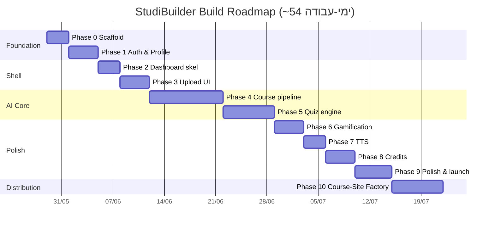

# StudiBuilder - Build Roadmap (11 Phases)

תרשים-העל של בניית הפרויקט מקצה לקצה. כל Phase מסתיים ב-merge + deploy לפרודקשן.

> **הערה**: Phase 10 (Course-Site Factory) נוסף בעקבות הפיווט-העסקי המתואר ב-[`ADR-006-course-as-product-factory.md`](architecture/ADR-006-course-as-product-factory.md). StudiBuilder הופך מ"פלטפורמת קורסים פתוחה" ל-Course-as-Product Factory: מוטי יוצר קורסים, וכל קורס נולד אוטומטית כמוצר-מסחרי עצמאי (landing + checkout + ads).

## תרשים זמן



## טבלת השלבים

| #   | Phase               | משך     | Lead                | Deliverables עיקריים                                                                                                                                                                                                                    |
| --- | ------------------- | ------- | ------------------- | --------------------------------------------------------------------------------------------------------------------------------------------------------------------------------------------------------------------------------------- |
| 0   | Foundation          | 3 ימים  | tech-lead           | Next.js scaffold, CI, Vercel deploy, RTL hello-world                                                                                                                                                                                    |
| 1   | Auth & Profile      | 4 ימים  | backend             | Supabase Auth (Google OAuth login + Magic link), settings page                                                                                                                                                                          |
| 2   | Dashboard skeleton  | 3 ימים  | frontend            | `/dashboard`, `/courses`, `/stats`, `/settings` (UI בלבד)                                                                                                                                                                               |
| 3   | Upload UI           | 4 ימים  | frontend            | wizard 5 שלבים (UI), upload to Supabase Storage                                                                                                                                                                                         |
| 4   | Course Pipeline     | 10 ימים | ml                  | Parse → Chunk → Embed → Topic → Lessons → Questions                                                                                                                                                                                     |
| 5   | Quiz Engine         | 7 ימים  | frontend            | `/lesson/[id]`, 4 סוגי שאלות, פידבק, deep-explanation                                                                                                                                                                                   |
| 6   | Gamification        | 4 ימים  | backend             | XP/streak/levels/daily-goal פעילים                                                                                                                                                                                                      |
| 7   | TTS                 | 3 ימים  | ml                  | ElevenLabs, 4 קולות עברית, cache                                                                                                                                                                                                        |
| 8   | Credits             | 4 ימים  | backend             | DB + cost calculator + transaction log                                                                                                                                                                                                  |
| 9   | Polish & Launch     | 5 ימים  | release-manager     | a11y, Lighthouse, error boundaries, onboarding                                                                                                                                                                                          |
| 10  | Course-Site Factory | 7 ימים  | tech-lead + backend | Landing-page templates (3), Auto-copywriter (Claude), Vercel REST provisioning, Stripe/Lemon-Squeezy checkout, ad campaigns (manual ב-MVP), admin analytics dashboard. ראה [ADR-006](architecture/ADR-006-course-as-product-factory.md) |

> **עדכון Phase 5 (2026-06-09):** מיני-קורס-התרחישים = **סימולציית-וועדה אינטראקטיבית** ([ADR-016](architecture/ADR-016-committee-simulation.md) · 3 מפקחים · 4 שלבים · ציון 0-100 · hybrid פרה-בנוי→LiveEngine), **המחליפה את ה-ScenarioWalkthrough הסטטי** ([ADR-014](architecture/ADR-014-scenario-engine.md)). מקור-השאלות = **בנק-NotebookLM רב-סוגי** ([ADR-015](architecture/ADR-015-notebooklm-content-engine.md) · ~500 · mcq/matching/open מקורפוס-החקיקה · status=מוסקנא), המחליף את בנק-ה-qa הישן.

## עקרון כל-שלב

```
[Plan]  ADR מתועד ב-docs/architecture/
   ↓
[Test] בדיקות כושלות כתובות לפני הקוד (TDD)
   ↓
[Code] מימוש מינימלי שגורם לבדיקות לעבור
   ↓
[Review] לפחות 1 agent quality (test/appsec/privacy לפי רלוונטיות)
   ↓
[Gates] Gate-A → Gate-G (ראה תוכנית-בניה חלק ד.3)
   ↓
[Deploy] PR → CI → preview → merge → production
   ↓
[Retro] docs/phase-N-retrospective.md
```

## Gates (חוצים-שלבים)

לפני merge כל PR:

- **Gate-A** lint clean (0 errors)
- **Gate-B** typecheck clean (0 errors)
- **Gate-C** unit tests >= 80% coverage על קוד חדש
- **Gate-D** e2e קריטי עובר
- **Gate-E** Lighthouse >= 90 (perf/a11y/best-practices) על preview
- **Gate-F** תיעוד מעודכן (ADR + screens-spec)
- **Gate-G** קוד-סקירה ידנית של appsec/privacy על PR שנוגע ב-data sensitive

## Risk register (תזכורת)

| סיכון                              | מיטיגציה                              |
| ---------------------------------- | ------------------------------------- |
| LLM יוצר שאלות שגויות עובדתית      | RAG + validation + manual spot-check  |
| TTS עברית באיכות נמוכה             | A/B providers לפני נעילה              |
| Vercel functions timeout (10s/60s) | LLM calls תמיד דרך Inngest            |
| RTL bugs ב-3rd party libs          | בדיקה ידנית פר-component + regression |
| LLM/TTS עלויות מתפוצצות            | rate limits + cost tracking + alerts  |
| Solo dev burnout                   | phases קצרים, deploy בכל phase        |

## מסמכים-עזר פר-Phase

- `docs/architecture/ADR-NNN-*.md` - החלטות-ארכיטקטורה (1 לפחות פר-Phase)
- `docs/screens-spec/*.md` - מפרט פר-מסך
- `docs/qa/phase-N-checklist.md` - בדיקות ידניות
- `docs/phase-N-retrospective.md` - מה למדנו (נכתב בסוף phase)

## פערים מודעים — חלוקה בין Phase 9 ל-Phase 10

**ב-Phase 9 (Polish & Launch):**

- Mobile native (iOS/Android) - לא, PWA מספיק
- רב-לשוניות (i18n) - הכנה ארכיטקטונית בלבד, עברית בלבד תחילה
- Manual course editor - אחרי MVP

**מועברים ל-Phase 10 (Course-Site Factory)** — אינם פערים פתוחים אלא scope מתוכנן:

- **Multi-user / org accounts** — בפועל מתממש כ-public learners פר-קורס (לא org-accounts; כל קורס = קהל-לומדים נפרד עם enroll-flow)
- **API ציבורי** — נשאר דחוי גם אחרי Phase 10 (אין use-case חיצוני)
- **תשלום אמיתי לקורסים** — Stripe/Lemon-Squeezy checkout per-course (ה-credits של Phase 8 נשארים פנימיים לאדמין; ראה ADR-006)
- **Landing-pages אוטומטיות + ads** — הליבה של Phase 10

ראה [ADR-006](architecture/ADR-006-course-as-product-factory.md) ו-חלק י"ב בתוכנית-העל.
